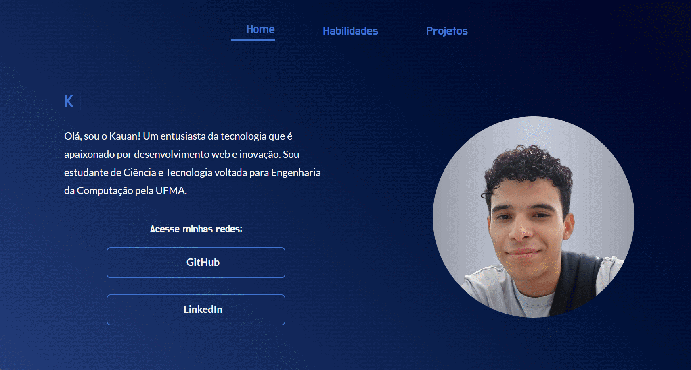

<h1 align="center">Portfolio Trilhas</h1>

    

 

    
    
    

 

    

        
        
    

<h2>💻 Sobre o projeto</h2>
    
O desafio proposto é uma oportunidade de aplicar os conhecimentos adquiridos durante as semanas de instrução do <strong>Alura Include</strong>. Por meio da construção de um portfólio, fui desafiado a demonstrar minhas habilidades práticas, utilizando <strong>HTML</strong>, <strong>CSS</strong> e <strong>JavaScript</strong> como as principais tecnologias para o desenvolvimento do projeto. Além disso, pude perceber que este exercício não apenas testa a compreensão dos conceitos ensinados, mas também destaca a criatividade e a capacidade de implementação de ideias.

<h2>👀 Deploy do projeto</h2>
    <ul>
        <li>Para ver a página funcionando, <a href="https://portfolio-trilhas-k1.vercel.app" target="_blank">clique aqui</a>.</li>
    </ul>

<h2>🛠️ Ferramentas utilizadas</h2>
    <ul>
        <li>Tecnonogias: HTML, CSS e JavaScript</li>
        <li>Utilitário: <a href="https://vercel.com
        " target="_blank">Vercel</a></li>
    </ul>

<h2>😉 Me siga</h2>

    
    
🚀Kauan Guilherme Santos🚀

    <a href="https://www.linkedin.com/in/kauan-guilherme-santos" target="_blank">
    

